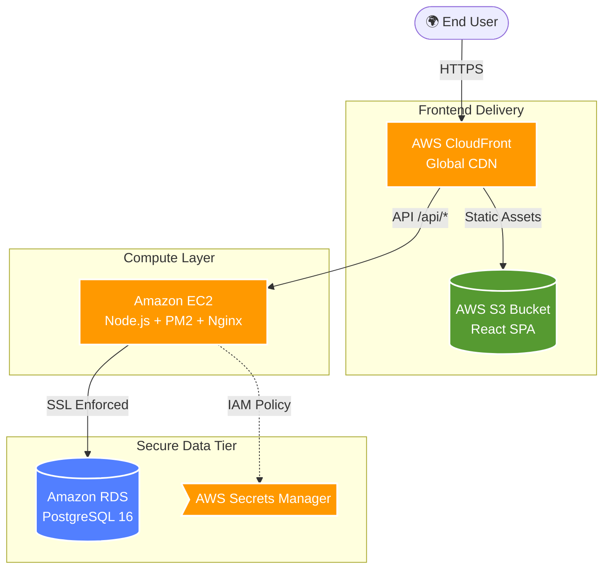

<div align="center">
  
  <h1>🐼 Panda - Cloud-Native E-Commerce Platform</h1>
  
  <p><b>Enterprise-grade AWS Architecture for a Full-Stack PERN Application</b></p>
  
  [](#)
  [](#)
  [](#)
  [](#)
  [](#)

  [](#)
  [](#)
  [](#)
</div>

<br />

> [!NOTE] 
> **Project Overview**
> Panda is a high-performance e-commerce dashboard and marketplace built on the PERN stack (PostgreSQL, Express, React, Node.js). This repository demonstrates a **highly decoupled, secure, and production-ready AWS deployment architecture** designed by a Cloud Engineer.

---

## 🗺️ AWS Architecture Diagram

The application is deployed utilizing a decoupled microservices-style infrastructure, ensuring security at multiple tiers, scalable asset delivery, and centralized secrets management.



---

## 🛡️ Cloud Engineering Highlights

As an AWS Cloud Engineer, migrating this project from local development to a production cloud environment required specific architectural and security implementations:

### 1. Reverse Proxy via Edge Location (CloudFront)
To bypass browser Mixed Content and CORS restrictions natively, CloudFront is deployed as a unified entry point. 
- **Behavior 1 (`/*`)**: Serves compiled standard React static assets purely from the S3 origin. 
- **Behavior 2 (`/api/*`)**: Proxies secure HTTP requests strictly to the backend EC2 origin, stripping unnecessary cookies but intelligently forwarding `Authorization` and `*` headers for Clerk session handling.

### 2. Zero-Trust Database Configurations (Amazon RDS)
- The raw PostgreSQL `Pool` initialization uses **mandatory SSL configuration** (`rejectUnauthorized: false`) in the backend driver to pass native AWS RDS encryptions securely. The database resides in a private, locked-down Security Group.

### 3. Keyless EC2 IAM Injection (AWS Secrets Manager)
To avoid `.env` file leakages on the server, the application relies on an **IAM Role Execution Policy**. A secure fetching script runs via the AWS SDK during deployment, allowing the EC2 instance to dynamically unpack secrets from Secrets Manager directly into Node's execution context.

---

## 🚀 Runbooks & Deployment Pipeline

This repository acts as an CI/CD emulator. Deployments are handled via custom bash deployment scripts.

### Backend Deployment (Compute Tier)
Re-deploying the Express framework directly to EC2 with zero-downtime using PM2.

```bash
cd backend

# Execute customized deployment bash script
./scripts/deploy-to-ec2.sh
```

**What the pipeline does:**
1. Executes `tsc` to rigorously type-check and build the typescript payloads to `dist/`.
2. Packages the build and uses cryptographic `scp` over SSH to push the package securely to the EC2 boundary.
3. Automatically triggers an NPM production install, executes the AWS Secrets Manager fetcher, and completes a seamless `pm2 restart` to roll over the application traffic seamlessly.

### Frontend Deployment (CDN & Edge Caching)
Pushing a new static build securely to the S3 bucket and triggering Edge invalidation.

```bash
cd frontend

# Step 1: Execute optimized production React build 
npm run build -- --mode production

# Step 2: Strictly synchronize payload with S3, deleting stale artifacts
aws s3 sync dist s3://productify-frontend-858977493574 --delete

# Step 3: Trigger a CloudFront Edge Cache Invalidation for immediate global delivery
aws cloudfront create-invalidation --distribution-id EG6ED9MDZZMGV --paths "/*" "/api/*"
```

---

## 🔧 Environment Variables Dictionary

If the application requires architectural variable amendments, they should be updated directly in the **AWS Secrets Manager Console**. 

| Variable | Description |
| :--- | :--- |
| `DATABASE_URL` | Full PostgreSQL connection string targeting the RDS endpoint. |
| `NODE_ENV` | `production` (Triggers SSL configurations). |
| `CLERK_PUBLISHABLE_KEY` | Public authentication token natively evaluated by the React layer. |
| `CLERK_SECRET_KEY` | Backend verification key handling Clerk symmetric middleware validation. |
| `FRONTEND_URL` | The CloudFront CNAME endpoint allowing internal API CORS evaluation. |

> [!WARNING]
> Do not attempt to manually pass standard `.env` variables onto the EC2 host. Rely entirely on the IAM integration to push configurations from Secrets Manager.

---

> Designed & Architected by a passionate **Cloud System Engineer**.
